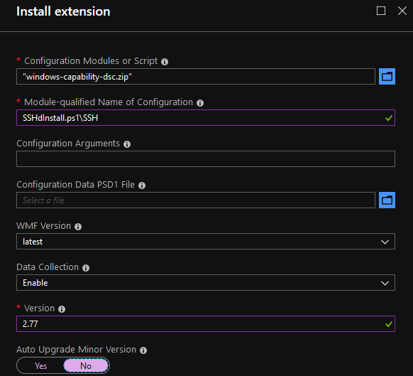

# WindowsCapabilityDsc

There's default DSC resources for WindowsFeature and WindowsOptionalFeature,
but not WindowsCapability.

I want to install OpenSSH Server!

**This has been tested on Azure Stack Hub 1910**

## Usage

```powershell
# Create a zip file which is uploaded using the DSC extension.
Compress-Archive -Path "windows-capability-dsc\*" -DestinationPath "windows-capability-dsc.zip" -Force
```

Configure the DSC extension through the portal as follows:


